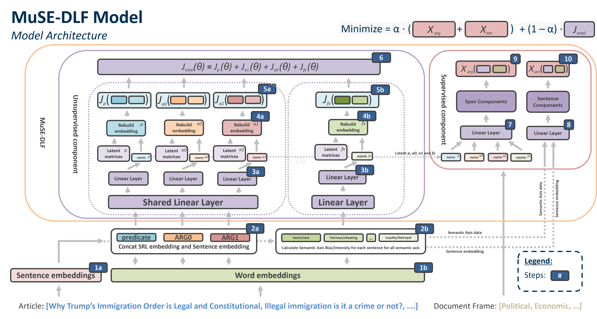

# MuSE-DLF: <strong>Mu</strong>lti-View-<strong>S</strong>emantic <strong>E</strong>nhanced <strong>D</strong>ictionary <strong>L</strong>earning for <strong>F</strong>rame Classification

Master thesis on explainable frame classification in news articles using multi-view semantic enhanced dictionary learning.

---

This repository contains the trained deep learning model from my master's thesis:

**Thesis Title:** MuSE-DLF: <strong>Mu</strong>lti-View-<strong>S</strong>emantic <strong>E</strong>nhanced <strong>D</strong>ictionary <strong>L</strong>earning for <strong>F</strong>rame Classification

**Author:** Elias Christian Anderlohr  
**Document:** [MuSE-DLF - Elias Anderlohr.pdf](https://github.com/elianderlohr/muse-dlf/blob/15127e19d2225ee9798e0f83ee3ba53286b01f21/assets/paper/MuSE-DLF%20-%20Elias%20Anderlohr.pdf)

For more details about the thesis, please refer to the PDF available in the `paper` directory.

## Abstract

This research advances the field of frame classification in news media through the creation of explainable deep learning models that incorporate semantic role labeling and semantic axis data. We present two novel models: SLMuSE-DLF for single-label frame classification and MuSE-DLF for multi-label frame classification. The SLMuSE-DLF model attained an accuracy of 0.643 and a macro-F1 score of 0.520 on the Media Frames Corpus. Meanwhile, the MuSE-DLF model secured a top-four position in the SemEval-2023 competition with a micro-F1 score of 0.553 and a macro-F1 score of 0.497. Notably, MuSE-DLF is the first model that provides multi-label frame classification along with explainability. It offers both strong classification performance and explainability, as demonstrated through visual techniques for semantic roles and biases. The MuSE-DLF's capability to identify multiple, concurrent frames within a single text more accurately mirrors real-world news framing. This work makes significant contributions to the field of Explainable AI in Natural Language Processing, enhancing our understanding of frame classification in news media while maintaining model explainability.

## Data Utilized

This research leverages two key datasets:

### Media Frames Corpus (MFC)

The MFC, a collection of news articles labeled with frame labels from "The Policy Frames Codebook," focuses on contentious policy issues like immigration, smoking, and gun control. This corpus includes both labeled and unlabeled articles from major U.S. newspapers spanning from 1980 to 2012, providing a rich source of data for frame analysis.

> Note: The MFC dataset is not publicly available. However, the data can be requested from the authors of the original paper. For more information, refer to the [Media Frames Corpus](https://aclanthology.org/P15-2072/) website. No guarantees are made regarding the availability of the dataset.

### SemEval-2023 Dataset Task 3

Comprising news articles in nine languages, the SemEval-2023 dataset covers international events from 2020 to mid-2022. It encompasses a wide range of topics, from the COVID-19 pandemic to the Russo-Ukrainian war. This dataset is annotated with frames from "The Policy Frames Codebook" and offers data in multiple languages, including English, French, German, and Russian.

> Note: The SemEval-2023 dataset is not publicly available. However, the data can be requested from the organizers of the SemEval-2023 Task 3 competition. For more information, refer to the [SemEval-2023](https://propaganda.math.unipd.it/semeval2023task3/) website. No guarantees are made regarding the availability of the dataset.

## Approach



The MuSE-DLF and SLMuSE-DLF model architecture incorporates both unsupervised and supervised components for comprehensive text processing.

1. Initially:
   a. Sentence embeddings are generated using a transformer model.
   b. Word embeddings are generated using a transformer model.

2. Processing embeddings:
   a. The word embeddings for the predicate, ARG0 (agent), and ARG1 (theme) are extracted and concatenated with the sentence embedding.
   b. In parallel, the FrameAxis bias and intensity values for a set of semantic axis are calculated and concatenated with the sentence embedding, resulting in additional dimensions.

3. Latent representation:
   a. These combined embeddings are processed through shared and individual linear layers to reduce dimensions and create latent representations.
   b. Same process for the parallel embeddings.

4. Reconstruction:
   a. Embeddings are reconstructed back to their original dimensions.
   b. Same process for the parallel embeddings.

5. Comparison:
   a. Reconstructed embeddings are compared to the original embeddings.
   b. Same process for the parallel embeddings.

6. The comparisons contribute to the total unsupervised loss J<sub>total</sub>.

7. For the supervised component, latent representations are averaged over all sentences.

8. These averaged representations are used to predict document-level frames.

9. Predicted frames are compared to the true classes.

10. Training aims to balance unsupervised and supervised losses, ensuring effective embedding reconstruction and accurate frame prediction.

## Experiments

We conducted two key experiments to evaluate the performance of the SLMuSE-DFL and MuSE-DLF model:

### Experiment 1: Media Frames Corpus (MFC) Application

- **Objective**: Enhance the FRISS model with the FrameAxis semantic role and bias data.
- **Methodology**: Train the new model called SLMuSE-DLF on the MFC dataset.
- **Evaluation Metrics**: Compare accuracy and macro-F1 score against the original FRISS model to gauge improvements.

#### Results

| Model                         | Acc.      | Macro-F1  |
| ----------------------------- | --------- | --------- |
| FRISS Khanehzar et al. (2021) | 0.697     | 0.605     |
| Khanehzar et al. (2019)       | 0.658     | -         |
| **SLMuSE-DLF (Best)**         | **0.643** | **0.520** |
| **SLMuSE-DLF (Mean)**         | **0.606** | **0.497** |
| Ji et al. (2017)              | 0.584     | -         |
| Field et al. (2018)           | 0.573     | -         |
| Card et al. (2018)            | 0.568     | -         |

Table: Performance analysis of various frame prediction models, trained using the Media Frames Corpus

### Experiment 2: SemEval 2023 Dataset Extension for Multi-label Prediction

- **Objective**: Enhance the SLMuSE-DLF model to predict multiple frames in a single text.
- **Methodology**: Train the new model called MuSE-DLF on the SemEval 2023 dataset.
- **Evaluation Metrics**: Use multi-label classification metrics like F1-score; compare results with SemEval 2023 challenge benchmarks.

#### Results

| Model                         | Acc.      | Macro-F1  |
| ----------------------------- | --------- | --------- |
| FRISS Khanehzar et al. (2021) | 0.697     | 0.605     |
| Khanehzar et al. (2019)       | 0.658     | -         |
| **SLMuSE-DLF (Best)**         | **0.643** | **0.520** |
| **SLMuSE-DLF (Mean)**         | **0.606** | **0.497** |
| Ji et al. (2017)              | 0.584     | -         |
| Field et al. (2018)           | 0.573     | -         |
| Card et al. (2018)            | 0.568     | -         |

Table: Overview of the top 10 models featured in the SemEval-2023 competition, including our introduced MuSE-DLF model. The task organizers provided the baseline for reference. For detailed details on the various models, refer to Piskorski et al. (2023).

## Usage

To run the MuSE-DLF model, follow these steps:

### Preparation

#### Dataset Preparation

1. Download the Media Frames Corpus and SemEval-2023 dataset.

2. Paste the data into the `data/` directory.

   - For the Media Frames Corpus, place the data in `data/mfc/`.

   - For the SemEval-2023 dataset, place the data in `data/semeval/`.

3. Open the [data preparation notebook](notebooks/prepare/prepare-dataset.ipynb) and run the cells to preprocess the data.

4. The notebook should generate the following files:

   - For the Media Frames Corpus: `data/mfc/immigration_labeled_preprocessed.json`

   - For the SemEval-2023 dataset: `data/semeval/mfc/semeval_train.json`, `data/semeval/mfc/semeval_dev.json`, and `data/semeval/mfc/semeval_test.json`

#### FrameAxis Data Preparation

1. Run the [MFC FrameAxis data preparation slurm script](run/mfc/frameaxis/preprocess_labeled.sh) to preprocess the FrameAxis data.

   - The script will generate the following files:
     - `data/mfc/frameaxis/frameaxis_mft.pkl` which contains the FrameAxis data.
     - `data/mfc/frameaxis/frameaxis_mft_contributions.json` which contains the word contributions (word-level bias) for each sentence and each important word.
     - `data/mfc/frameaxis/frameaxis_mft_microframes.json` which contains the contextualized microframes measurements for all 5 microframes.

2. Run the [SemEval FrameAxis data preparation slurm scripts](run/semeval/frameaxis/) to preprocess the FrameAxis data for the `dev`, `test`, and `train` datasets.

   - The `train` script will generate the: `data/semeval/frameaxis/semeval_microframe.pkl` which contains the contextualized microframes measurements for all 5 microframes.

   - The script will generate the following file each for the `dev`, `test`, and `train` datasets:
     - `data/semeval/frameaxis/semeval_dev.pkl`, `data/semeval/frameaxis/semeval_test.pkl`, and `data/semeval/frameaxis/semeval_train.pkl` which contains the FrameAxis data.
   - The script will generate the following file each for the `dev`, `test`, and `train` datasets:
     - `data/semeval/frameaxis/semeval_dev_contributions.json`, `data/semeval/frameaxis/semeval_test_contributions.json`, and `data/semeval/frameaxis/semeval_train_contributions.json` which contains the word contributions (word-level bias) for each sentence and each important word.

#### Semantic Role Labeling Data Preparation

1. Run the [MFC SRL data preparation slurm script](run/mfc/srl/preprocess_labeled.sh) to preprocess the SRL data.

   - The script will generate the following files:
     - `data/srls/mfc/mfc_labeled.pkl` which contains the SRL data.

2. Run the [SemEval SRL data preparation slurm scripts](run/semeval/srl/) to preprocess the SRL data for the `dev`, `test`, and `train` datasets.

   - The `train` script will generate the: `data/srls/semeval/semeval_train.pkl` which contains the SRL data.

   - The script will generate the following file each for the `dev`, `test`, and `train` datasets:
     - `data/srls/semeval/semeval_dev.pkl`, `data/srls/semeval/semeval_test.pkl`, and `data/srls/semeval/semeval_train.pkl` which contains the SRL data.

### Fine-Tuning RoBERTa

We fine tuned the RoBERTa model on the Media Frames Corpus and the SemEval-2023 dataset. The fine-tuned models are used as the base model for the MuSE-DLF and SLMuSE-DLF models.

#### Media Frames Corpus

Run the [MFC RoBERTa fine-tuning slurm script](run/mfc/mlm/train.sh) to fine-tune the RoBERTa model on the Media Frames Corpus.

> Note: this script requires the MFC data in form train and `test_data.txt` and `train_data.txt` files which should be located under `data/mfc/mfc`. They are generated by the data preparation notebook.

You can download out fine-tuned RoBERTa model from [here](https://drive.google.com/drive/folders/1UAD6_A5z0hPWbHgXwL42NQTuSgYzX7aT?usp=sharing).

#### SemEval-2023 Dataset

Run the [SemEval RoBERTa fine-tuning slurm script](run/semeval/mlm/train.sh) to fine-tune the RoBERTa model on the SemEval-2023 dataset.

> Note: this script requires the SemEval-2023 data in form train and `test_data.txt` and `train_data.txt` files which should be located under `data/semeval/muse-dlf`. They are generated by the data preparation notebook.

You can download out fine-tuned RoBERTa model from [here](https://drive.google.com/drive/folders/1UBkGQUKOQEsTat5G0k31MymQZZUN9fMu?usp=sharing).

### Training

Train the two models using the following commands:

> Note: We use the `slurm` scripts to run the training on a cluster. We use the cluster from the Baden Wuerttemberg Grid (BwUniCluster2.0) and the Baden Wuerttemberg Grid (Helix) for training. You can run the training locally by running the training scripts directly, which are located in the `src/start_train.py` file.

> Note: We use `wandb` (Weights & Biases) for logging the training process. So create a `.env` file with the following content:

```bash
WANDB_API_KEY=your_wandb_api_key
```

#### SLMuSE-DLF

Run the [SLMuSE-DLF training slurm script](run/mfc/slmuse-dlf/train/train.sh) to train the model on the Media Frames Corpus.

Example slurm execution:

```bash
sbatch --partition=gpu_4 -t 01:00:00 run/mfc/slmuse-dlf/train/train.sh
```

This script will train the model on the `gpu_4` partition for 1 hour. The slurm script is setup to require 4 GPUs.

You can download the trained models from [here](https://drive.google.com/drive/folders/1Tv0TaKZJ2VwhKSoS_oBQcxkkCgFGa_Lr?usp=sharing).

##### WandB

We use `wandb` for logging the training process. The script will automatically create a project on `wandb` called `slmuse-dlf` and log the training process.

The training script will automatically saves the best model based on the `accuracy` metric to wandb. The model will be saved in the `wandb` project under the `artifacts` section.

#### MuSE-DLF

Run the [MuSE-DLF training slurm script](run/semeval/muse-dlf/train/train.sh) to train the model on the SemEval-2023 dataset.

Example slurm execution:

```bash
sbatch --partition=gpu_4 -t 01:00:00 run/semeval/muse-dlf/train/train.sh
```

This script will train the model on the `gpu_4` partition for 1 hour. The slurm script is setup to require 4 GPUs.

You can download the trained models from [here](https://drive.google.com/drive/folders/1Tvy91rDFpfa_1asNxlcZsVo3XzJ7LxEt?usp=sharing).

##### WandB

We use `wandb` for logging the training process. The script will automatically create a project on `wandb` called `muse-dlf` and log the training process.

The training script will automatically saves the best model based on the `micro-f1` metric to wandb. The model will be saved in the `wandb` project under the `artifacts` section.

### Inference

To run inference on the trained models get the correct model settings from the `config-json.json` file in the google drive folder.

#### Inference with WandB

If you got access to our WandB Project you do not need to download the model. You can download the models from WandB directly. Example code can be seen in the explainability notebooks under: `notebooks/explainability/`.

## Code Structure

### Training, Preprocessing and Model Code

All code to preprocess the data and train the models is located in the `src/` directory.

**Models**

- `src/model/`: Contains the MuSE-DLF and SLMuSE-DLF models in the `muse-dlf` and `slmuse-dlf` directories.

**Training**

- `src/start_train.py`: Is the main training script to train the MuSE-DLF and SLMuSE-DLF models.

**Other**

The other files in the `src/` directory are used for data preprocessing (`src/preprocessing`), pushing datasets to wandb (`src/create_dataset.py`), and other utility functions.

### Notebooks

The notebooks directory contains various Jupyter notebooks used for data preparation, model training, and explainability analysis.

#### Data Preparation

Prepare the two datasets for training the MuSE-DLF and SLMuSE-DLF models.

- [prepare-dataset.ipynb](notebooks/prepare/prepare-dataset.ipynb): Data preparation notebook for the Media Frames Corpus and SemEval-2023 dataset.

#### Data Evaluation

Evaluation notebooks to better understand the MFC and SemEval-2023 datasets.

- [mfc-dataset.ipynb](notebooks/evaluation/mfc-dataset.ipynb): Evaluation of the Media Frames Corpus.
- [semeval-dataset.ipynb](notebooks/evaluation/semeval-dataset.ipynb): Evaluation of the SemEval-2023 dataset.

#### FrameAxis

Evaluation of the MFC and SemEval-2023 datasets using FrameAxis data.

- [mfc-frameaxis-analysis.ipynb](notebooks/analysis/mfc-frameaxis-analysis.ipynb): FrameAxis analysis of the Media Frames Corpus.
- [semeval-frameaxis-analysis.ipynb](notebooks/analysis/semeval-frameaxis-analysis.ipynb): FrameAxis analysis of the SemEval-2023 dataset.

#### Explainability

Evaluation of the explainability of the SLMuSE-DLF and MuSE-DLF models.

- [slmuse-dlf-explainability.ipynb](notebooks/explainability/slmuse-dlf-explainability.ipynb): Explainability analysis of the SLMuSE-DLF model.
- [muse-dlf-explainability.ipynb](notebooks/explainability/muse-dlf-explainability.ipynb): Explainability analysis of the MuSE-DLF model.

#### Other

Notebooks for token-to-word analysis. The notebook contains the experiments for the token-to-word analysis to see how many words are represented by how many tokens.

- [tokenizer-token-to-word-ratio.ipynb](notebooks/other/tokenizer-token-to-word-ratio.ipynb): Token-to-word analysis of the RoBERTa tokenizer.

### Additional Plots

Additional plots generated for the thesis.

- [mfc-plots.ipynb](notebooks/plots/mfc-plots.ipynb): Plots generated for the SLMuSE-DLF model.
- [semeval-plots.ipynb](notebooks/plots/semeval-plots.ipynb): Plots generated for the MuSE-DLF model.

## Achknowledgements

I would like to express my sincere gratitude to Marlene Lutz, M.Sc. and Ivan Smirnov, Ph.D. for providing important feedback and guidance throughout the development of this thesis. I also thank BwUniCluster 2.0 and the Helix cluster for providing access to high-performance computing resources essential for this work. I acknowledge support by the state of Baden-Württemberg through bwHPC. Furthermore, I acknowledge support by the state of Baden-Württemberg through bwHPC and the German Research Foundation (DFG) through grant INST 35/1597-1 FUGG.
